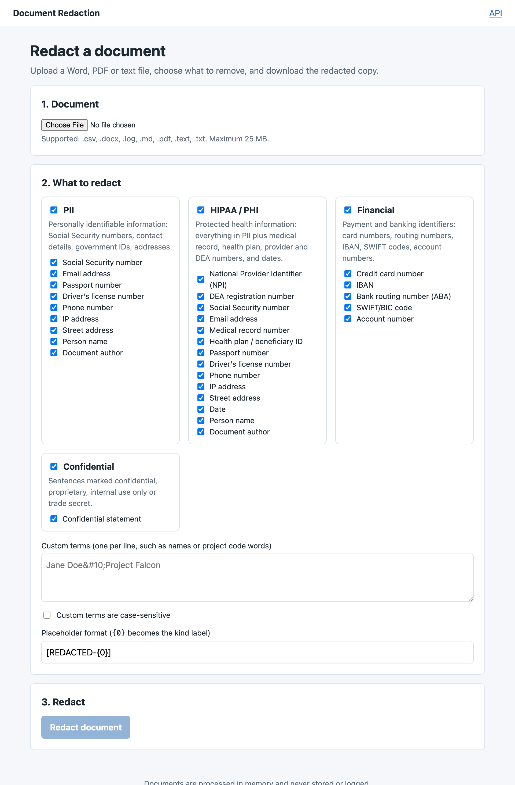

# Document Redaction

A .NET 10 service that removes PII, HIPAA/PHI, financial, and confidential information from
Word (.docx), PDF, and plain-text documents. Upload a document, choose what to redact, download
the redacted copy. Nothing is persisted and document content is never logged.

Tracking issue: [#1](https://github.com/wloescher/DocumentRedaction/issues/1). Work log: [TASKS.md](TASKS.md).
End-user guide: [ENDUSER.md](ENDUSER.md).



## How it works

1. The upload is buffered in memory and routed to a processor by extension (then content type).
2. The processor extracts text in units that keep formatting intact: the whole file for text,
   one paragraph at a time for Word (joined across runs), one layout block at a time for PDF.
3. The Core engine runs one detector per enabled kind, resolves overlaps (longest span wins,
   then kind priority), and substitutes placeholders such as `[REDACTED-SSN]`.
4. The processor writes the same format back and the response carries a per-kind count report.

### Categories and kinds

| Category | Kinds |
|---|---|
| PII | SSN, email, phone, IP address, passport, driver's license, street address, person name (heuristic), document author (Word metadata, comments, tracked changes) |
| HIPAA / PHI | everything in PII plus MRN, health plan / Medicare beneficiary ID, NPI, DEA number, dates |
| Financial | credit card (Luhn), ABA routing number, IBAN (mod-97), SWIFT/BIC, account number |
| Confidential | whole sentences containing markers such as "confidential", "proprietary", "internal use only", "trade secret" |

Custom terms (names, project code words) can be added to any run and apply regardless of
category selection. Detection is pattern-based with checksum validation where a checksum
exists; kinds that would otherwise be ambiguous (passport, driver's license, MRN, account
number, SWIFT) require an introducing keyword such as "Passport:".

Person names are found by heuristics, not a language model. A name is proposed after an
abbreviated honorific ("Dr. Jane Smith"), after a spelled-out title when two name words follow
("Captain James Cook", but not "General Ledger"), after a form label with a colon or dash
("Patient: Smith, John A.", "Attn: Jane Smith"), after a salutation or sign-off ("Dear John,",
"Sincerely,\nJane Smith"), or as a capitalised pair whose first word is on an embedded list of
common given names ("Jane Smith reviewed"). The honorific or label stays in the document. A
name ends before the first word that plainly ends one (Date, Street, Inc, a month, a pronoun),
never crosses a line break, and a custom term of the same length wins over it. Given names
that are also ordinary words ("Mark", "May", "Grace") count only mid-sentence.

### Known limitations

- Person-name detection is heuristic. It misses names whose given name is not on the list
  (many non-Anglophone names), names written in capitals, single surnames without an honorific
  or label, names of more than five words, names with a month as a middle name, and names that
  open a sentence when the given name is also a word ("Mark Twain wrote"). It can over-redact
  title-case phrases that start with a listed name and organisation names built from a
  person's name ("Taylor Wimpey"). Untick the "Person name" kind to turn it off; add custom terms for the
  misses. The `IDetector` interface is the seam for adding a named-entity model.
- Free-form addresses in unusual formats are not detected; the address rule expects a house
  number, street name and suffix.
- Dates under HIPAA are noisy (invoice dates get redacted too); untick the Date kind if needed.
- PDF output is redrawn from the extracted text: every word is placed where it was, at its size,
  weight and slant, so line breaks, columns, bullets, page sizes and page count survive. Fonts are
  substituted by generic family (serif, sans-serif, monospace), colours are not kept, and images
  and vector graphics are dropped. Redacted spans become black boxes labelled with the placeholder
  (or just the kind, such as EMAIL, when the span is too short for the full label, or nothing when
  it is too short even for that). Scanned PDFs with no text layer are rejected with a clear error.
- Bare 10-digit and 9-digit numbers are only reported as NPI or routing numbers when their
  checksum passes, so a small share of unrelated numbers can still be over-redacted.
- In PDFs a confidentiality sentence is redacted up to the line breaks around it (Word and text
  files know where sentences end; a PDF block often does not). Identifiers wrapped across two
  lines are still found because detection also runs on the block with its lines joined. Text keeps
  its direction, whether the page is rotated or a line is set at a slant.
- Parsing caps (see Configuration) bound decoded size, page count and text. An LZW stream
  larger than `MaxDecodedBytes / 2560` on disk is rejected unread because LZW cannot be measured
  without decoding; such streams are rare outside PDFs from the 1990s.

## Layout

```
DocumentRedaction.slnx
  src/DocumentRedaction.Core          detection model, detectors, text redaction engine (no external deps)
  src/DocumentRedaction.Documents     text / Word (Open XML SDK) / PDF (PdfPig + QuestPDF) processors, service facade
  src/DocumentRedaction.Web           Blazor Server page + minimal REST API + OpenAPI
  tests/DocumentRedaction.Core.Tests
  tests/DocumentRedaction.Documents.Tests
  tests/DocumentRedaction.Web.Tests   WebApplicationFactory integration tests
  tests/DocumentRedaction.Tests.Fixtures  in-memory .docx / .pdf builders shared by the test projects
```

## Prerequisites

.NET 10 SDK. `global.json` pins the 10.0 feature band and opts `dotnet test` into
Microsoft.Testing.Platform. If `dotnet --version` reports 8.x, your PATH puts
`/usr/local/share/dotnet` ahead of `~/.dotnet`; either reorder PATH or call `~/.dotnet/dotnet`.

QuestPDF renders the redacted PDFs. Its Community license is free for organisations under the
revenue threshold published at questpdf.com; above it, buy the Professional or Enterprise tier
and set `Redaction:QuestPdfLicense` accordingly (see Configuration). Review that before
commercial deployment.

## Build, test, run

```bash
dotnet build
```

```bash
dotnet test
```

```bash
dotnet run --project src/DocumentRedaction.Web --launch-profile http
```

Then open http://localhost:5039. The OpenAPI document is at `/openapi/v1.json`.

## API

Every `/api` route is gated by an optional API key and a rate limiter (see Configuration). When
keys are configured, send one in the `X-Api-Key` header; without any configured key the API is
open and the host logs a warning at startup. The Blazor page calls the service in-process and
needs neither.

`GET /api/categories` lists categories and the kinds each covers.

`POST /api/redact` takes `multipart/form-data` and returns the redacted file as an attachment.
Counts by kind are in the `X-Redaction-Report` header (JSON) and `X-Redaction-Total`.

| Field | Meaning |
|---|---|
| `file` | The document (required). `.txt .md .csv .log .text .docx .pdf` |
| `categories` | `pii`, `hipaa`, `financial`, `confidential`, or `all`. Repeat the field or comma-separate. Default: none |
| `excludedKinds` | Kind names to skip, e.g. `Date`. Repeat or comma-separate |
| `customTerms` | Literal terms, one per line or one per repeated field |
| `placeholderFormat` | Composite format; `{0}` becomes the kind label. Default `[REDACTED-{0}]` |
| `customTermsAreCaseSensitive` | `true` / `false` |

`POST /api/redact/summary` takes the same form and returns only `{ fileName, contentType, sizeBytes, report }`.

```bash
curl -sS -o report-redacted.docx -D - -H "X-Api-Key: $REDACTION_API_KEY" \
  -F "file=@report.docx" -F "categories=pii,financial" -F "excludedKinds=Date" -F "customTerms=Jane Doe" \
  http://localhost:5039/api/redact
```

Errors use RFC 9457 problem details: 400 validation, 401 missing or wrong API key, 413 upload
too large or over a parsing cap, 415 unsupported type, 422 corrupt, encrypted, or text-free
document, 429 over the rate limit (with a `Retry-After` header in seconds). The report (header
and summary JSON) carries `warnings`, currently used for embedded objects and imported content
a Word file contains.

## Configuration

All keys live under `Redaction` and are validated at startup; an invalid value stops the host.

| Key | Default | Purpose |
|---|---|---|
| `MaxUploadBytes` | 26214400 (25 MB) | Bounds the in-memory buffer; enforced by the API, the page, Kestrel and the form reader. At most 2,147,418,111 because the upload is buffered into one array. |
| `Limits:MaxDecodedBytes` | 67108864 (64 MB) | Largest decoded size of one PDF stream or one Word package part. Word checks the zip directory before opening and the XML reader stops at the same cap. PDF streams are bounded before they are decoded: Flate by deflate's 1032:1 ceiling and, above that, a trial inflate that only counts; LZW (2560:1 in PdfPig) and RunLength (64:1) by their ratio; CCITT and predictor rows by the sizes in the stream dictionary. |
| `Limits:MaxTotalDecodedBytes` | 1073741824 (1 GB) | Budget for all decoding in one PDF, including the trial inflates, so many streams each under the cap cannot monopolise CPU. |
| `Limits:MaxTextCharacters` | 5000000 | Cap on text extracted from a PDF across all pages. Every glyph is kept with its geometry until the pages are redrawn (about 120 bytes per character), so this is also the memory bound per request. |
| `Limits:MaxPdfPages` | 2000 | PDFs with more pages are rejected before any text is extracted. |
| `ApiKeys` | `[]` (open) | Keys accepted in `X-Api-Key` on `/api`; each at least 16 visible ASCII characters (no spaces), no repeats. Empty leaves the API open and logs a startup warning; a single value instead of a list fails startup. Each key comparison is constant-time; keys are never logged. Supply them through environment variables (`Redaction__ApiKeys__0`, `Redaction__ApiKeys__1`, ...) or a secrets store rather than appsettings.json. |
| `RateLimit:Enabled` | `true` | Set `false` when a gateway in front of the host throttles instead. |
| `RateLimit:PermitLimit` | 60 | Requests allowed per window. Each valid API key has its own window; all other callers (open mode, missing or wrong key) share one window per client address, so key guessing is throttled too. |
| `RateLimit:WindowSeconds` | 60 | Fixed window length, at most 4,294,967. Rejections are 429 with `Retry-After` set to the window length (an upper bound on the wait). |
| `QuestPdfLicense` | `Community` | `Community`, `Professional` or `Enterprise`; the tier this deployment is entitled to. |

Exceeding a cap returns 413 with the cap in the message. The caps are `DocumentLimits` in the
Documents project; other hosts pass a factory to `AddDocumentRedaction` and validate at startup.
The rate limiter keys on the connection's remote address; behind a reverse proxy, configure
forwarded headers before relying on per-address limits, or disable the limiter and throttle at
the proxy.

## Word metadata

Besides the text, a .docx names people in places a reader never sees. With PII or HIPAA selected,
the creator and last editor in the core properties, the manager in the application properties,
and the author on every comment and tracked change in any part (body, headers, footnotes, styles,
numbering, glossary) are replaced with the document-author placeholder and counted under
"Document author"; initials are removed and the reviewer list (`people.xml`) is deleted. Untick
that kind to keep them. Title, subject, keywords, description, company and string-valued custom
properties go through the ordinary detectors. Embedded objects (OLE, embedded Office files),
imported HTML/RTF chunks and SmartArt are not opened; the response lists them as warnings so
nobody assumes they were scanned.

## Extending detection

Implement `IDetector` (or derive from `RegexDetector`), add the kind to `InformationKind` and
`InformationKinds`, and register the detector in `DetectorRegistry`. A test in Core fails if a
text kind has no detector; kinds flagged `MetadataOnly` are the exception, redacted by document
processors from structure rather than text.
